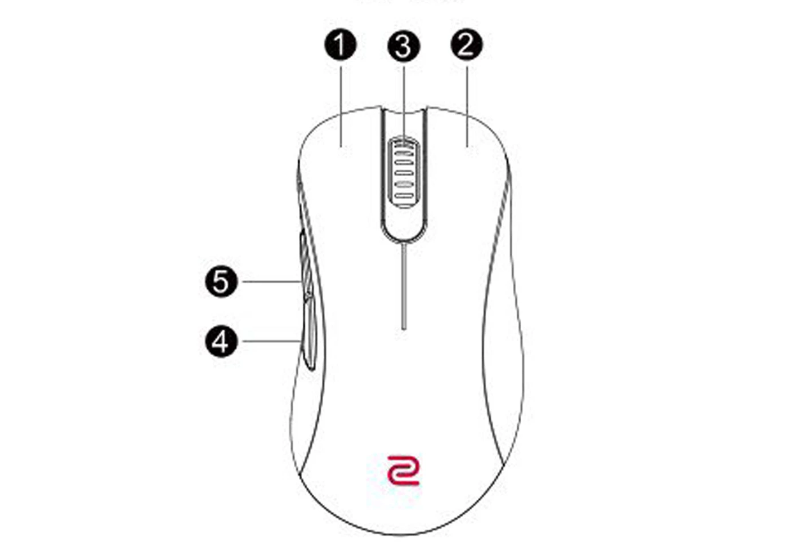

# Mouse Gestures for Windows

A Windows application that provides mouse gesture functionality for quick navigation between windows, virtual desktops, and more.

<video width="450" controls>
  <source src="video.mov" type="video/mp4">
</video>

## Features

- Mouse gesture support using Mouse Button 5 (XButton2)
- System tray icon with settings and about menu
- Automatic startup support as a windows service
- Gesture actions:
  - Horizontal movement: Switch virtual desktops
  - Vertical movement up: Windows Tab view
  - Vertical movement down: Show desktop/Windows Tab
  - Mouse wheel while holding action button: Alt+Tab switching

## Installation

### Using the Installer (Recommended)

1. Download the latest `MouseGestures_Installer.exe` from the releases page
2. Run the installer as Administrator
3. Choose your installation options:
   - Install as Windows Service (runs at startup)
   - Install as normal application
   - Create desktop shortcut
   - Create Quick Launch icon
4. Follow the installation wizard
5. The application will start automatically after installation

### Manual Installation

If you prefer not to use the installer:

1. Download the exe file from the releases page
2. Extract to your preferred location
3. Run `BetterMouse.exe` directly

## Usage

1. Hold Mouse Button 5 (XButton2) to activate gesture mode
2. While holding:
   - Move mouse left/right to switch virtual desktops
   - Move mouse up to open Windows Tab view
   - Move mouse down to show desktop or Windows Tab
   - Use mouse wheel to Alt+Tab between windows
3. Release Mouse Button 5 to complete the gesture

Reference below to locate Mouse Button 5

## System Requirements

- Windows 10 or later
- Administrator privileges (for installation)
- Microsoft Visual C++ Redistributable 2022 (included in installer)

## Building from Source

1. Ensure you have Visual Studio 2022 with C++ desktop development tools installed
2. Install Inno Setup 6 or later (for building the installer)
3. Open the solution in Visual Studio
4. Build the solution in Release mode
5. Run `iscc installer.iss` to create the installer

### Building the Installer

1. Install Inno Setup 6 or later
2. Open `installer.iss` in Inno Setup
3. Click Build > Compile
4. The installer will be created in the `installer_output` directory

## Troubleshooting

If the application fails to start:
1. Check Windows Event Viewer for error messages
2. Ensure you have administrator privileges
3. Verify Microsoft Visual C++ Redistributable 2022 is installed
4. Try running as a normal application first to verify functionality

For service installation issues:
1. Open Services (services.msc)
2. Check if "Mouse Gestures Service" exists and its status
3. Try stopping and starting the service manually
4. Check service logs in Event Viewer

## Uninstallation

1. Use Windows Settings > Apps > Apps & features
2. Find "Mouse Gestures" and click Uninstall
3. Follow the uninstallation wizard

Or:
1. Run the uninstaller directly from the installation directory
2. The uninstaller will automatically stop and remove the service if installed

## License

This software is open-source and free to use. 